<div align="center">

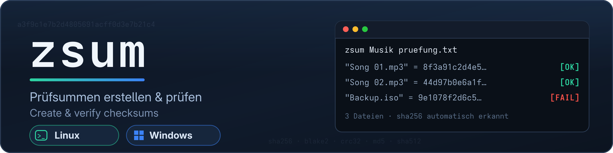

# zsum

**Prüfsummen erstellen und prüfen — unter Linux und Windows**
**Create and verify checksums — on Linux and Windows**

[](#)
[](#)
[](#)
[](LICENSE)
[](#)

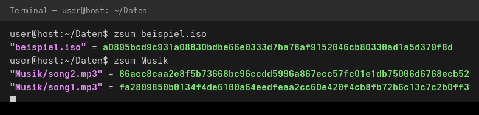 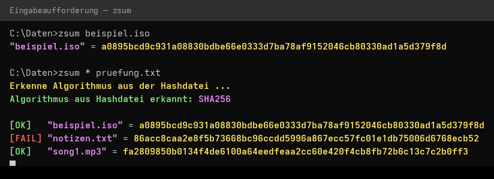

**[Deutsch](#-deutsch) | [English](#-english)**

</div>

---

## 🇩🇪 Deutsch

`zsum` berechnet Prüfsummen (Hashes) von Dateien und vergleicht sie auf Wunsch mit einer Hashdatei — farbig, auf Deutsch oder Englisch, ohne jegliche Zusatzsoftware. Es gibt zwei baugleiche Skripte:

| Datei | Plattform | Unterbau |
|---|---|---|
| `zsum` | Linux | Bash + Standardwerkzeuge (`sha256sum`, `md5sum`, `b2sum`, `cksum`, `openssl`) |
| `zsum.bat` | Windows | Batch + Bordmittel (`certutil`) |

### ✨ Funktionen

- **Viele Algorithmen** — MD5, SHA1, SHA256, SHA384, SHA512 u. a. (Details siehe [Tabelle](#-algorithmen))
- **Einzelne Dateien, ganze Ordner oder Platzhalter** (`*.txt`) auf einmal verarbeiten
- **Hashdatei-Abgleich** — zsum vergleicht jede berechnete Prüfsumme mit einer Referenzdatei und meldet `[OK]` oder `[FAIL]`
- **Automatische Algorithmus-Erkennung** beim Abgleich (aus Hashdateiname bzw. Hashlänge)
- **Zweisprachig** — Ausgabe auf Deutsch oder Englisch (`-de` / `-en`)
- **Farbige Ausgabe** mit automatischem Abschalten bei Umleitung in Dateien (`> datei.txt`), nicht-VT-fähigen Konsolen, `-nc` oder `NO_COLOR`
- **Keine Abhängigkeiten** — nur Bordmittel des jeweiligen Betriebssystems

### 📦 Voraussetzungen

**Linux:** Bash und die coreutils (`md5sum`, `sha256sum`, `b2sum`, `cksum`) — auf praktisch jeder Distribution vorinstalliert. Optional `openssl` für MD2, MD4 und BLAKE2S.

**Windows:** Windows 10 oder 11 (ältere Versionen ab Windows 7 funktionieren ebenfalls). `certutil` ist fester Bestandteil von Windows; zusätzlich wird nur für den Farbtalent-Check kurz PowerShell aufgerufen — fehlt es, schaltet zsum einfach die Farben ab und läuft normal weiter.

### 🚀 Installation

Damit `zsum` von überall aufrufbar ist, legt man die Skriptdatei in einen Ordner, der in der **Umgebungsvariable `PATH`** liegt.

#### Linux

Empfohlen: der persönliche Binär-Ordner `~/.local/bin` (bei den meisten Distributionen bereits in `PATH`):

```bash
mkdir -p ~/.local/bin
cp zsum ~/.local/bin/
chmod +x ~/.local/bin/zsum
```

Falls `~/.local/bin` nicht in `PATH` liegen sollte, in `~/.bashrc` ergänzen:

```bash
echo 'export PATH="$HOME/.local/bin:$PATH"' >> ~/.bashrc
source ~/.bashrc
```

Alternative für **alle Benutzer** des Systems:

```bash
sudo cp zsum /usr/local/bin/
sudo chmod +x /usr/local/bin/zsum
```

Funktioniert es? Neue Konsole öffnen und prüfen:

```bash
zsum --help
```

#### Windows

1. Ordner anlegen, z. B. `C:\Tools\zsum`, und die Datei `zsum.bat` dorthin kopieren.
2. Diesen Ordner in die Umgebungsvariable `PATH` aufnehmen — am einfachsten über die Systemeinstellungen:
   - **Start-Menü** → „**Umgebungsvariablen bearbeiten**“ (bzw. „Umgebungsvariablen für Ihren Account bearbeiten“) suchen und öffnen
   - Eintrag **`Path`** auswählen → **Bearbeiten…** → **Neu** → `C:\Tools\zsum` → dreimal **OK**
3. **Neue** Eingabeaufforderung/PowerShell öffnen (offene Fenster übernehmen Änderungen nicht) und testen:

```
zsum -h
```

Alternativ per PowerShell-Einzeiler (statt der Systemeinstellungen):

```powershell
[Environment]::SetEnvironmentVariable(
  "Path",
  [Environment]::GetEnvironmentVariable("Path", "User") + ";C:\Tools\zsum",
  "User")
```

> **Hinweise:**
> - Der Befehlsname entspricht dem Dateinamen: `zsum.bat` wird einfach als `zsum` aufgerufen. Wer das Skript umbenennt (z. B. in `csum.bat`), ruft es entsprechend unter dem neuen Namen auf.
> - `zsum` funktioniert sowohl in der Eingabeaufforderung (cmd) als auch in PowerShell.
> - Ein `.bat`-Skript unterliegt **keiner** PowerShell-ExecutionPolicy — es läuft ohne Zusatzeinstellungen.

### 🖥️ Verwendung

```
zsum [Optionen] "Pfad" [Algorithmus] [Hashdatei]
```

**Optionen**

| Option | Bedeutung |
|---|---|
| `-h`, `--help` (Windows zusätzlich: `/?`, `-?`) | Hilfeseite anzeigen |
| `-de` / `-en` | Ausgabe auf Deutsch bzw. Englisch erzwingen |
| `-nc`, `--no-color` (nur Linux) | Farben für diesen Aufruf abschalten |

**Beispiele**

Einzelne Datei prüfen (Standard ist SHA-256):

```bash
zsum beispiel.iso
zsum beispiel.iso MD5          # anderer Algorithmus
```


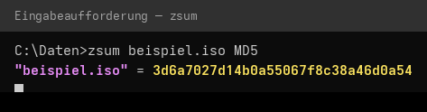

Ganze Ordner oder Platzhalter verarbeiten:

```bash
zsum Musik                     # alle Dateien im Ordner
zsum '*.iso'                   # Platzhalter (Linux: in Anführungszeichen oder ohne)
zsum *.iso SHA512
zsum beispiel.iso BLAKE2       # Linux: auch BLAKE2 und CRC32
zsum beispiel.iso CRC32
```

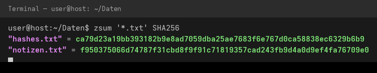
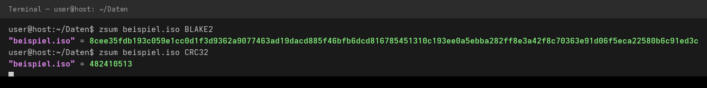

Prüfsummen in eine Datei speichern (Umleitung) und später abgleichen:

```bash
zsum Musik > pruefung.txt      # speichern
zsum Musik pruefung.txt        # abgleichen
```

Beim Abgleich meldet zsum je Datei `[OK]` oder `[FAIL]` — so fällt eine veränderte oder beschädigte Datei sofort auf:

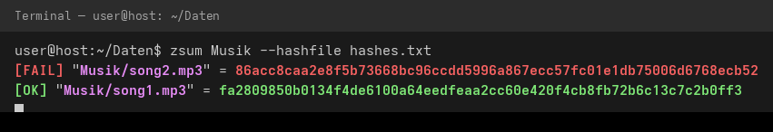

Hilfeseite:

```bash
zsum --help                    # Linux
zsum -h                        # Windows
```

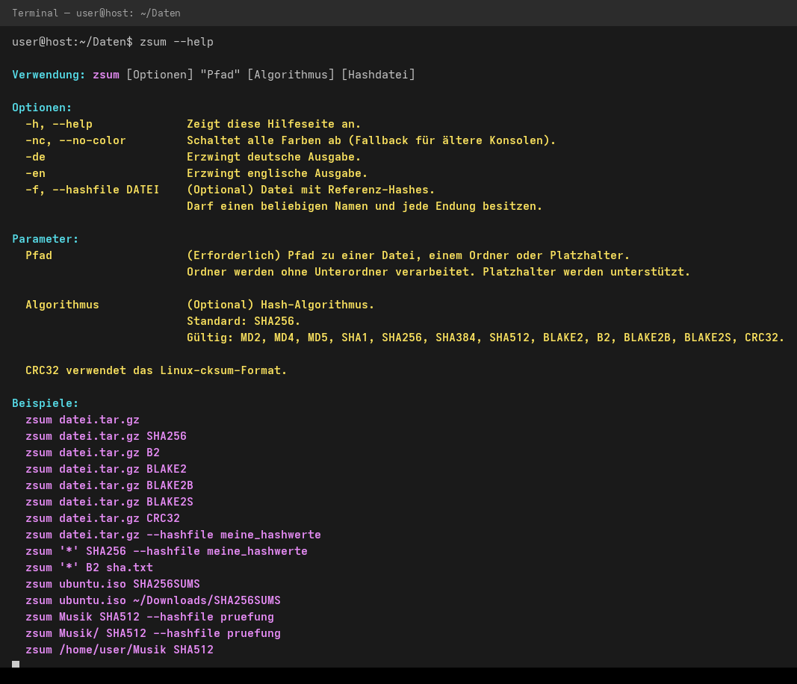
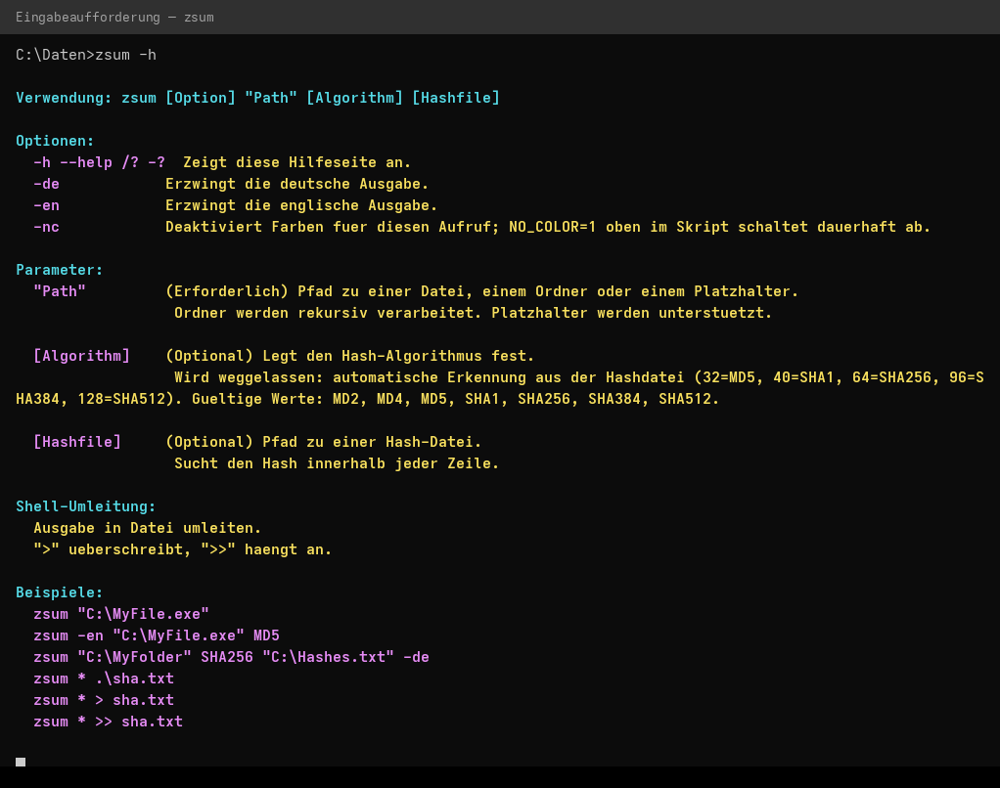

#### 📋 Geeignete Hashdatei-Formate

zsum sucht den berechneten Hash **zeichenweise innerhalb jeder Zeile** der Hashdatei (Groß-/Kleinschreibung egal). Deshalb funktionieren u. a.:

- die eigene Ausgabe von zsum (`"datei" = hash`)
- GNU-Format (`sha256sum`-Stil): `hash  datei`
- nackte Hash-Werte, ein Hash pro Zeile (z. B. certutil-Ausgabe, Downloads von Servern)

Wurde kein Algorithmus angegeben, erkennt zsum ihn **automatisch aus der Hashdatei** (Hashlänge: 32 = MD5, 40 = SHA1, 64 = SHA256, 96 = SHA384, 128 = SHA512); unter Linux zusätzlich aus bekannten Dateinamen wie `SHA256SUMS` oder `*.md5`. Eine explizite Angabe hat immer Vorrang.

#### Umbenennen
Sie könnt das Script beliebig umbenennen, es wird dann in der Hilfe und den Beispielen diesen neuen Namen anzeigen.

#### 🧮 Algorithmen

| Algorithmus | Linux | Windows |
|---|---|---|
| MD2, MD4 | ✅ (openssl) | ✅ (certutil) |
| MD5 | ✅ | ✅ |
| SHA1 | ✅ | ✅ |
| SHA256, SHA384, SHA512 | ✅ | ✅ |
| BLAKE2 / BLAKE2B, BLAKE2S | ✅ | ❌ (certutil kennt kein BLAKE2) |
| CRC32 (Linux-cksum-Format) | ✅ | ❌ |

Standard ist **SHA256**. Windows-Nutzer geben MD2/MD4 am besten explizit an — bei der automatischen Erkennung werden sie wegen der gleichen Länge wie MD5 interpretiert; BLAKE2 lässt sich an der Länge nicht eindeutig erkennen.

#### 🌐 Sprache

Mit `-de` und `-en` wird die Sprache aller Meldungen und der Hilfeseite pro Aufruf umgeschaltet:

```bash
zsum -en beispiel.iso SHA512
zsum -en urlaub.iso SHA512     # Fehlermeldung auf Englisch
```

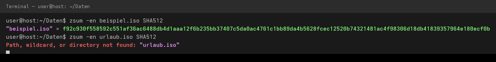
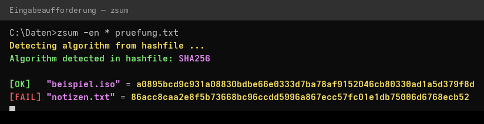

### 🔀 Unterschiede zwischen Linux und Windows

| | Linux (`zsum`) | Windows (`zsum.bat`) |
|---|---|---|
| Algorithmen | inkl. BLAKE2, BLAKE2S, CRC32 | MD2–SHA512 (certutil) |
| Ordner werden verarbeitet | **ohne** Unterordner | **rekursiv, inkl.** Unterordner |
| Hashdatei angeben | letzter Parameter | letzter Parameter |
| Algorithmus-Auto-Erkennung | Hashlänge **und** Dateiname (z. B. `SHA256SUMS`) | Hashlänge |
| Farben dauerhaft abschalten | Umgebungsvariable `NO_COLOR` | `NO_COLOR=1` oben im Skript setzen |

### ❓ Tipps & Fehlerbehebung

- **„zsum: command not found“ / „nicht erkannt“** — nach dem PATH-Eintrag ein **neues** Konsolenfenster öffnen; unter Linux `echo $PATH` prüfen.
- **Farben stören** (z. B. alte Konsole): Aufruf mit `-nc`, unter Linux zusätzlich dauerhaft per Umgebungsvariable `NO_COLOR`.
- **Zwei Dateien, gleicher Länge, falscher Algorithmus?** Bei Abgleich mit explizit angegebenem Algorithmus bleibt alles eindeutig — im Zweifel SHA256 verwenden.
- **Exit-Codes:** `0` = alles gut, `1` = Fehler (z. B. Pfad nicht gefunden) — praktisch für eigene Skripte.

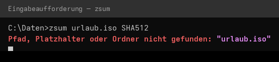

### 📄 Lizenz

Copyright (c) 2025 cvinz78 — lizenziert unter der **MIT-Lizenz**, siehe [LICENSE](LICENSE). Die MIT-Lizenz erlaubt die freie Verwendung, Veränderung und Weitergabe — auch in kommerziellen Projekten; einzigen Bedingung ist der Erhalt des Copyright-Hinweises.

---

## 🇬🇧 English

`zsum` computes checksums (hashes) of files and optionally compares them against a hashfile — colorful, in German or English, with no extra software required. Two functionally identical scripts are included:

| File | Platform | Built on |
|---|---|---|
| `zsum` | Linux | Bash + standard tools (`sha256sum`, `md5sum`, `b2sum`, `cksum`, `openssl`) |
| `zsum.bat` | Windows | Batch + built-ins (`certutil`) |

### ✨ Features

- **Many algorithms** — MD5, SHA1, SHA256, SHA384, SHA512 and more (see [table](#-algorithms-1))
- **Single files, entire folders or wildcards** (`*.txt`) in one go
- **Hashfile comparison** — every computed checksum is checked against a reference file, reporting `[OK]` or `[FAIL]`
- **Automatic algorithm detection** during comparison (from the hashfile name and/or hash length)
- **Bilingual** — output in German or English (`-de` / `-en`)
- **Colored output** that switches itself off when redirecting to a file (`> file.txt`), on non-VT consoles, with `-nc` or `NO_COLOR`
- **Zero dependencies** — only built-in operating system tools

### 📦 Requirements

**Linux:** Bash and coreutils (`md5sum`, `sha256sum`, `b2sum`, `cksum`) — preinstalled on virtually every distribution. Optional `openssl` for MD2, MD4 and BLAKE2S.

**Windows:** Windows 10 or 11 (older versions down to Windows 7 also work). `certutil` ships with Windows; PowerShell is only invoked briefly for the color-capability check — if it is unavailable, zsum simply disables colors and keeps working.

### 🚀 Installation

To run `zsum` from anywhere, place the script file into a folder that is part of the **`PATH` environment variable**.

#### Linux

Recommended: your personal bin folder `~/.local/bin` (already on `PATH` in most distributions):

```bash
mkdir -p ~/.local/bin
cp zsum ~/.local/bin/
chmod +x ~/.local/bin/zsum
```

If `~/.local/bin` is not on your `PATH`, add it to `~/.bashrc`:

```bash
echo 'export PATH="$HOME/.local/bin:$PATH"' >> ~/.bashrc
source ~/.bashrc
```

Alternative for **all users** of the system:

```bash
sudo cp zsum /usr/local/bin/
sudo chmod +x /usr/local/bin/zsum
```

Verify in a new terminal:

```bash
zsum --help
```

#### Windows

1. Create a folder, e.g. `C:\Tools\zsum`, and copy `zsum.bat` into it.
2. Add that folder to the `PATH` environment variable — easiest via the system settings:
   - **Start menu** → search for “**Edit environment variables for your account**” and open it
   - Select **`Path`** → **Edit…** → **New** → `C:\Tools\zsum` → **OK** three times
3. Open a **new** command prompt / PowerShell (already-open windows do not pick up the change) and test:

```
zsum -h
```

Alternatively, a one-liner in PowerShell (instead of the system settings):

```powershell
[Environment]::SetEnvironmentVariable(
  "Path",
  [Environment]::GetEnvironmentVariable("Path", "User") + ";C:\Tools\zsum",
  "User")
```

> **Notes:**
> - The command name equals the file name: `zsum.bat` is simply invoked as `zsum`. If you rename the file (e.g. to `csum.bat`), use the new name accordingly.
> - `zsum` works in both the command prompt (cmd) and PowerShell.
> - A `.bat` script is **not** subject to the PowerShell execution policy — it runs without any extra settings.

### 🖥️ Usage

```
zsum [options] "path" [algorithm] [hashfile]
```

**Options**

| Option | Description |
|---|---|
| `-h`, `--help` (Windows also: `/?`, `-?`) | Show the help page |
| `-de` / `-en` | Force German or English output |
| `-nc`, `--no-color` (Linux only) | Disable colors for this call |

**Examples**

Hash a single file (SHA-256 is the default):

```bash
zsum beispiel.iso
zsum beispiel.iso MD5          # different algorithm
```


Process folders or wildcards:

```bash
zsum Music                     # all files inside the folder
zsum '*.iso'                   # wildcard
zsum *.iso SHA512
zsum beispiel.iso BLAKE2       # Linux: BLAKE2 and CRC32 as well
zsum beispiel.iso CRC32
```


Save checksums to a file (redirection) and verify later:

```bash
zsum Music > hashes.txt              # save
zsum Music hashes.txt                # verify
```

During verification zsum reports `[OK]` or `[FAIL]` per file, so modified or corrupted files are spotted instantly:


Help page:

```bash
zsum --help                    # Linux
zsum -h                        # Windows
```


#### 📋 Supported hashfile formats

zsum searches for the computed hash **as a substring within each line** of the hashfile (case-insensitive). Therefore all of these work:

- zsum’s own output (`"file" = hash`)
- GNU format (`sha256sum` style): `hash  file`
- bare hash values, one per line (e.g. certutil output, hashes downloaded from servers)

If no algorithm was specified, zsum **auto-detects it from the hashfile** (hash length: 32 = MD5, 40 = SHA1, 64 = SHA256, 96 = SHA384, 128 = SHA512); on Linux, well-known file names such as `SHA256SUMS` or `*.md5` are recognized as well. An explicit algorithm always takes precedence.

#### Renaming

You can rename the script as you like; it will then display this new name in the help section and the examples.

#### 🧮 Algorithms

| Algorithm | Linux | Windows |
|---|---|---|
| MD2, MD4 | ✅ (openssl) | ✅ (certutil) |
| MD5 | ✅ | ✅ |
| SHA1 | ✅ | ✅ |
| SHA256, SHA384, SHA512 | ✅ | ✅ |
| BLAKE2 / BLAKE2B, BLAKE2S | ✅ | ❌ (certutil has no BLAKE2) |
| CRC32 (Linux cksum format) | ✅ | ❌ |

The default is **SHA256**. On Windows, specify MD2/MD4 explicitly — due to their length, automatic detection interprets them as MD5; BLAKE2 cannot be identified by length alone.

#### 🌐 Language

`-de` and `-en` switch the language of all messages and the help page per call:

```bash
zsum -en beispiel.iso SHA512
zsum -en urlaub.iso SHA512     # error message in English
```


### 🔀 Differences between Linux and Windows

| | Linux (`zsum`) | Windows (`zsum.bat`) |
|---|---|---|
| Algorithms | incl. BLAKE2, BLAKE2S, CRC32 | MD2–SHA512 (certutil) |
| Folders are processed | **without** subfolders | **recursively, incl.** subfolders |
| Provide hashfile | last parameter | last parameter |
| Algorithm auto-detection | hash length **and** file name (e.g. `SHA256SUMS`) | hash length |
| Disable colors permanently | `NO_COLOR` environment variable | set `NO_COLOR=1` at the top of the script |

### ❓ Tips & troubleshooting

- **“zsum: command not found”** — open a **new** console window after changing `PATH`; on Linux check `echo $PATH`.
- **Colors cause trouble** (e.g. on legacy consoles): pass `-nc`, or disable them permanently on Linux via the `NO_COLOR` environment variable.
- **Exit codes:** `0` = success, `1` = error (e.g. path not found) — handy for your own scripts.


### 📄 License

Copyright (c) 2025 cvinz78 — licensed under the **MIT License**, see [LICENSE](LICENSE). The MIT license permits free use, modification, and distribution — including in commercial projects; the only condition is keeping the copyright notice.
